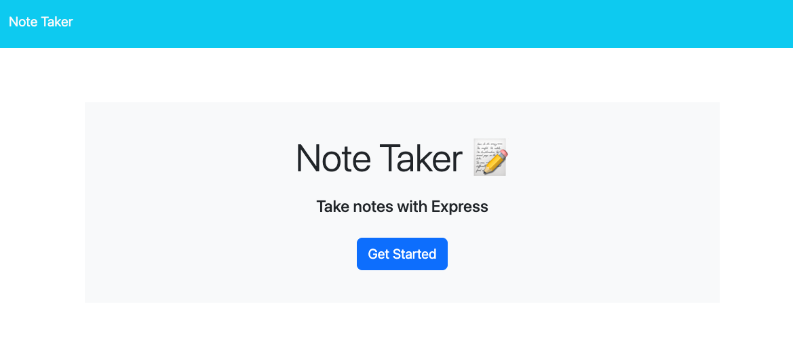
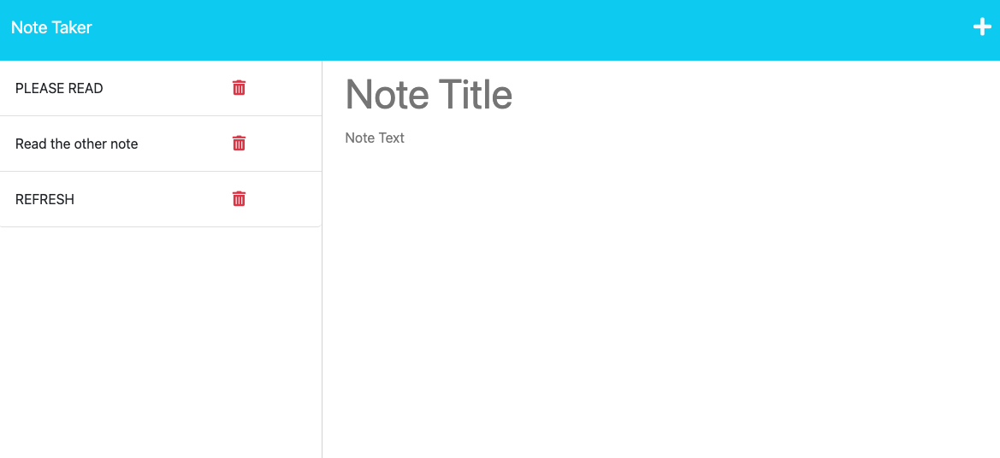

# Miniature Eureka

    

## Description
    
    A Note Taker that can be used to write and save notes. This application will use an Express.js back end and will save and retrieve note data from a JSON file.

## Table of Contents

    
- [Installation](#installation) 
- [Usage](#usage) 
- [Licenses](#licenses) 
- [Contribute](#contribute) 
- [Testing](#testing) 
- [Questions](#questions)

    
## Installation
    
    Git clone repo. No install needed, just visit the webpage.

## Usage
[Demo](https://drive.google.com/file/d/1JXlAqppxJcF6-S9_SYqDlDUyHg0tU4Z9/view)]
    See video demo.

## Licenses

    

MIT License

## Contribute

    Git clone repo and submit PR, will merge upon review/approval.

## Testing

    Through usage. 

## Questions
 

Please reach out via Github: https://github.com/jshvaron or create an issue on the correlating repo page. For any further communication, please email me: nomail@mail.com.

